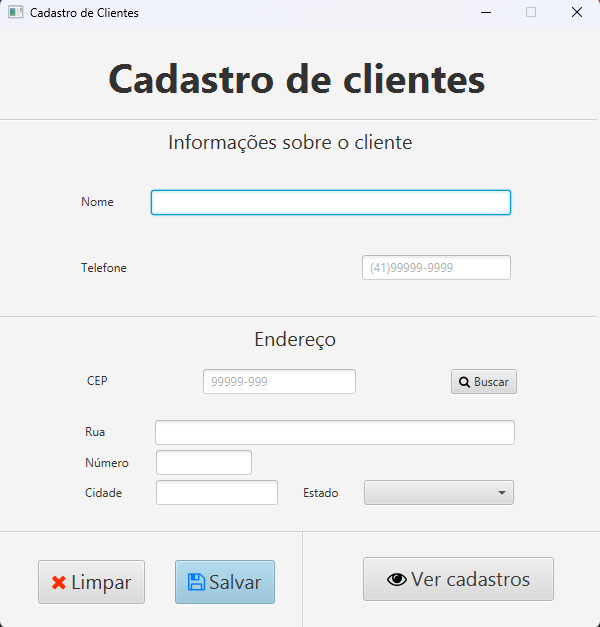

# Cadastro de clientes

Trabalho de programação II no segundo ano de Graduação de Ciência da Computação na UENP.

O projeto consiste em uma simples aplicação java com interface JavaFX que cadastra clientes em um ArrayList. 

Os clientes podem ser posteriormente visualizados através do botão "ver cadastros".

A aplicação é bem simples e não possui muitas funcionalidades.

